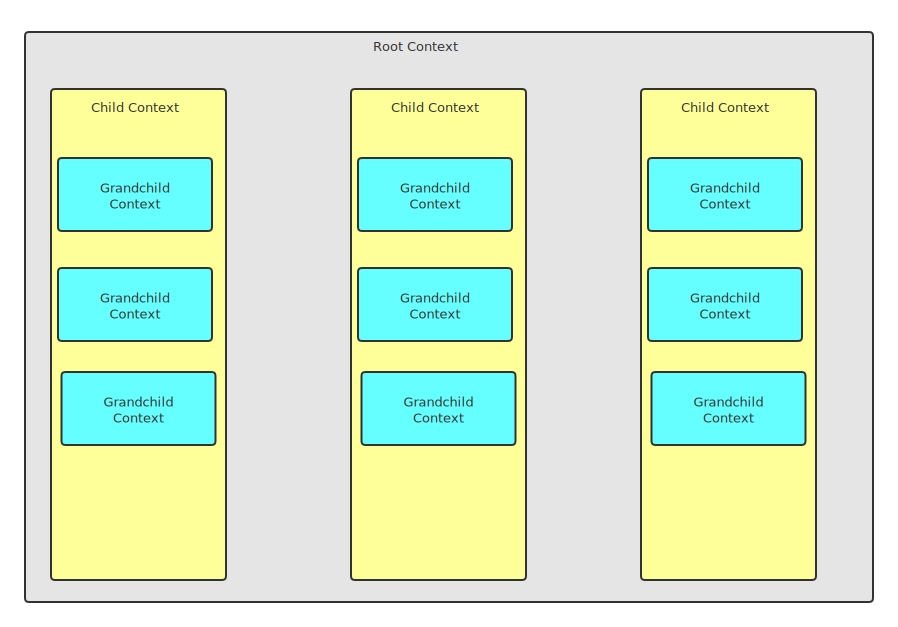

<h1 align="center">Beanify</h1>

## Encapsulation

A fundamental feature of Beanify is the "encapsulation context.".A visual representation of the encapsulation context is shown in the following figure



In the above figure, there are several entities:

1. The _root context_
2. Three _child contexts_
3. Three _child contexts_ where each _child context_ has
   - Three _grandchild contexts_

Every child context and grandchild context has access to the root plugins. Within each child context the granchild contexts have access to the child plugins registered within the containing child context, but the containing child context does not have access to the child plugins registered within its grandchild context.

```javascript
beanify
  .decorate('rootdec', 'rootdec')
  .register(
    async c1 => {
      c1.decorate('c1dec', 'c1')
      c1.register(
        async c2 => {
          c2.decorate('c2dec', 'c2')
          console.log('c2dec:' + c2.hasDecorator('c2dec')) // true
          console.log('c1dec:' + c2.hasDecorator('c1dec')) // true
          console.log('c3dec:' + c2.hasDecorator('c3dec')) // false
          console.log('rootdec:' + c2.hasDecorator('rootdec')) // true
        },
        { name: 'c2' } // new scope
      )
      console.log('c2dec:' + c1.hasDecorator('c2dec')) // false
      console.log('c1dec:' + c1.hasDecorator('c1dec')) // true
      console.log('c3dec:' + c1.hasDecorator('c3dec')) // false
      console.log('rootdec:' + c1.hasDecorator('rootdec')) // true
    },
    { name: 'c1' } // new scope
  )
  .register(
    async c3 => {
      c3.decorate('c3dec', 'c3')
      console.log('c2dec:' + c3.hasDecorator('c2dec')) // false
      console.log('c1dec:' + c3.hasDecorator('c1dec')) // false
      console.log('c3dec:' + c3.hasDecorator('c3dec')) // true
      console.log('rootdec:' + c3.hasDecorator('rootdec')) // true
    },
    { name: 'c3' } // new scope
  )
```
